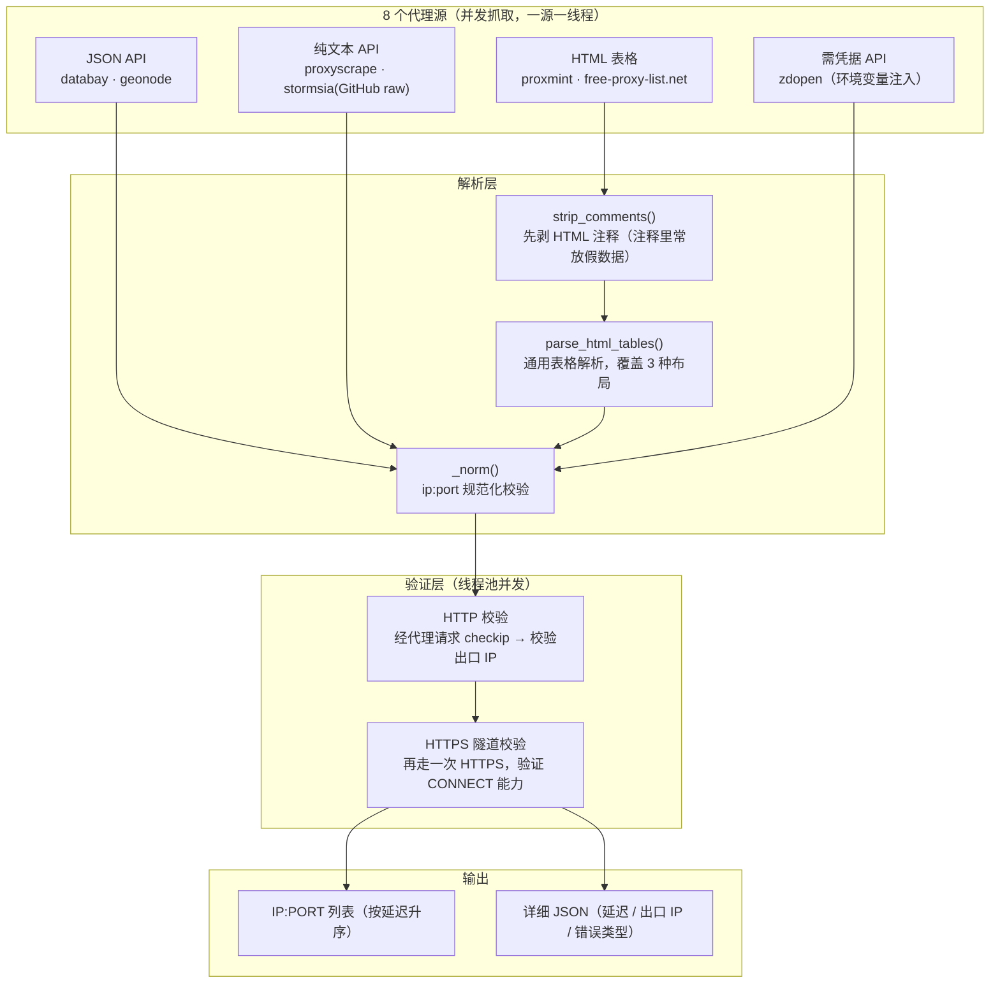

<div align="center">

# Proxy Pool

### 单文件、零服务依赖的免费代理聚合与验证模块

**Python 3 · requests · BeautifulSoup · 8 个代理源 · `import proxy_pool` 即用**

[](https://github.com/Konglong7/proxy-pool/actions/workflows/ci.yml)
[](https://www.python.org/)
[](#七依赖)
[](./LICENSE)
[](#-参与贡献)

</div>

---

## 📖 目录

- [一、它解决什么问题](#一它解决什么问题)
- [二、实测数据](#二实测数据)
- [三、架构与工作流](#三架构与工作流)
- [四、项目结构](#四项目结构)
- [五、核心实现](#五核心实现)
- [六、快速开始](#六快速开始)
- [七、依赖](#七依赖)
- [八、配置](#八配置)
- [九、已知边界（重要）](#九已知边界重要)
- [十、安全与合规](#十安全与合规)
- [十一、License](#十一license)

---

## 一、它解决什么问题

做采集/自动化时，需要一批能用的代理 IP。现成方案通常有两个问题：**要么依赖一套需要部署的中间件**（Redis + 调度器 + 常驻服务），**要么拿到的列表里 90% 是死的**。

这个模块的定位是**极简的按需聚合器**：

| 需求 | 本模块的做法 |
|------|-------------|
| 不想为了拿几个代理就部署一套服务 | **单文件模块**，`import proxy_pool` 即用；没有数据库、没有常驻进程、没有 Web 界面 |
| 单一免费源随时会挂 | **同时聚合 8 个源**（HTTP API / HTML 表格 / GitHub raw / 需凭据的 API 四种形态都有），单源失效不影响整体 |
| 免费代理列表水分极大 | **真实验证**：每个候选都通过代理实际请求 `checkip.amazonaws.com`，并校验返回的出口 IP |
| 只要 HTTP 代理不够，还得能走 HTTPS | **双协议校验**：先验 HTTP 连通，再验 HTTPS **隧道（CONNECT）**能力，两个维度分开记录 |
| 抓到的代理站有反爬（注释里放假数据、动态表格） | 解析器**先剥离 HTML 注释**再解析，并用通用表格解析器覆盖 3 种布局 |

**一句话**：它不维护一个「池」，而是**在你需要的时候，用几十秒到几分钟现抓现验一批能用的代理**。

---

## 二、实测数据

> 以下数字是**本仓库代码在真实网络环境下的实跑结果**，命令见 [六、快速开始](#六快速开始)。
> 免费代理的可用性**随时间剧烈波动**，这里的数字只代表**一次运行**，不是可用率承诺。

**运行环境**：Windows 11 · Python 3.11.9 · 本机直连（无系统代理）

| 指标 | 实测值 |
|------|--------|
| 已注册的源 | **8 个** |
| 本次实际生效的源 | **7 个**（`zdopen` 因未配置凭据被跳过；`netvortex` 返回 0 条，源已失效） |
| 抓到的候选（去重后） | **875 个** |
| 验证后可用 | **225 个** |
| **可用率** | **约 25.7%**（225 / 875） |
| 全流程耗时 | **156.9 秒**（抓取 + 验证 + 导出） |
| 延迟 min / P50 / max | **218 ms / 4095 ms / 18927 ms** |
| 其中 HTTPS 隧道可用 | **125 / 181 ≈ 69%**（对可用子集二次校验时统计） |

### 逐源产出（本次运行）

| 源 | 形态 | 抓到条数 |
|----|------|---------:|
| databay | JSON API | 200 |
| proxyscrape | 纯文本 API | 200 |
| free-proxy-list.net | HTML 表格（含 SSL 页） | 200 |
| stormsia | GitHub raw 文本 | 200 |
| geonode | JSON API（带元数据） | 154 |
| proxmint | HTML 表格 | 50 |
| netvortex | JSON API | **0**（源已失效） |
| zdopen（站大爷） | 需凭据的 JSON API | **0**（本次未配置凭据，已优雅跳过） |

### 三个值得单独说的读数

1. **可用率约 26%** —— 也就是说「免费代理列表里四分之三是死的」，这是免费源的常态，
   也正是不做验证就没法用的原因。
2. **延迟中位数 4.1 秒** —— 这个数字比可用率更致命。**免费代理适合「低频、容忍慢」的场景，
   不适合任何对延迟敏感的任务。**做批量采集时真正的瓶颈通常不在你的代码，而在这里。
3. **源会无声地死掉** —— `netvortex` 本次返回 0 条。代码对每个源都是独立 `try/except`，
   单源失效只体现为该源条数为 0，整体流程照常完成。**定期巡检源的有效性比调参更重要。**

---

## 三、架构与工作流



**多轮补足机制**：`get_working(min_count, rounds)` 会抓取 → 验证 → 若可用数不足 `min_count`
则**再抓一轮**（最多 `rounds` 轮），并且已获得的代理不会重复计入。这样既不用一次抓太多，
又能在源质量波动时自动补足。

---

## 四、项目结构

```
proxy-pool/
├── proxy_pool.py                 # ★ 核心交付物：单文件模块（约 360 行）
├── requirements.txt              #   requests + beautifulsoup4 + lxml
├── docs/
│   └── INTEGRATION-GUIDE.md      #   接入指南：9 章，含逐源接入说明、验证标准、与其它项目对接、受限站点清单
├── explore/                      #   建站期对 20+ 代理源的反爬探查脚本（非运行时依赖）
│   ├── README.md                 #   说明这些脚本的定位与"为何不能开箱即跑"
│   ├── fetchers.py               #   多源抓取实现（含 JS 混淆源）
│   ├── main_collect.py           #   批量采集入口
│   ├── make_report.py            #   生成源质量报告
│   ├── probe1.py / inspect2.py / inspect_raw.py / parse_rendered.py
│   ├── js_render.js              #   动态渲染页提取
│   ├── spys_eval*.js             #   spys.one 的 JS eval-packer 端口混淆解码
│   ├── chk_*.py / dbg_retry.py   #   逐源协议与反爬专项探查
│   └── proxy_sites_report.md     #   代理站点调研报告
├── .github/workflows/ci.yml      #   语法检查 + 模块可用性 + 仓库卫生门禁
├── LICENSE
└── README.md
```

> `explore/` 里的脚本**不是运行时依赖**，其中一部分原先依赖抓取快照（`raw/*.html`）与数据文件，
> 而那些内容已从仓库移除（见 [九、已知边界](#九已知边界重要)），所以它们**不能开箱即跑**——
> 保留的目的是展示当时对动态渲染表格、JS 混淆编码等反爬手段的探查方法。

---

## 五、核心实现

### 5.1 通用 HTML 表格解析（覆盖 3 种布局）

免费代理站的表格结构五花八门，这里没有为每个站写一个解析器，而是做了一个**通用解析器**：

```python
def parse_html_tables(body: str) -> List[Dict]:
    """通用表格解析：支持 IP/Port 分列、单元格内 ip:port、'ip : port' 三种布局。"""
    soup = BeautifulSoup(strip_comments(body), "lxml")   # ← 先剥离注释
    ...
    for c in texts:              # 布局A：单元格内含 ip:port
        m = pair.search(c)
    for i, c in enumerate(texts):  # 布局B：独立 IP 列 + 紧跟的数字端口列
        m = IP_ONLY.fullmatch(c.strip())
        for j in range(i + 1, min(len(texts), i + 6)):     # 端口通常在其后 1–5 个单元格
            ...
```

两个细节值得说：

- **先剥离 HTML 注释**（`strip_comments`）—— 这是针对真实的对抗手段：被注释掉的表格里
  常被塞进大量**假 ip:port**，用来污染不剥注释的爬虫。不剥注释就会把垃圾当候选项，白白浪费验证配额。
- **端口列搜索窗口限制为 5 个单元格**（`min(len(texts), i + 6)`）—— 避免把同一行里
  无关的数字（如国家码、匿名度评分）误当成端口。

### 5.2 双协议校验：HTTP 通 ≠ HTTPS 能用

```python
def test_proxy(ip_port: str, timeout: int = 8, check_https: bool = True) -> Dict:
    """单代理验证：HTTP checkip 200且返回IP => 可用；再测HTTPS隧道。"""
```

很多免费代理只能转发**明文 HTTP**，遇到 HTTPS 请求就直接失败。只验 HTTP 通的代理，
在真实 HTTPS 采集场景里是**不可用的**。所以这里把两个维度分开记录：

| 字段 | 含义 |
|------|------|
| `http_ok` | 经该代理访问 `http://checkip.amazonaws.com/` 返回 200 **且**响应体里能解析出 IP |
| `https_ok` | 再走一次 **HTTPS** 且成功 —— 说明该代理支持 `CONNECT` 隧道 |
| `exit_ip` | 代理回显的出口 IP（可与候选 IP 对比，识别透明代理） |
| `ms` | 端到端耗时，用于最终按延迟升序排列 |

> 只验「请求成功」而不验「出口 IP 是否真被代理改写」，会把**透明代理**（根本没换 IP）
> 当成可用代理。校验响应体里的 IP 就是为了排掉这种情况。

### 5.3 并发模型

| 环节 | 实现 | 参数 |
|------|------|------|
| 抓取 | `ThreadPoolExecutor(max_workers=len(sources))`，一源一线程 | 8 源 → 8 线程 |
| 验证 | `ThreadPoolExecutor`，可配 | 默认 `workers=50` |
| 单源条数上限 | 防止某个大源淹没其它源 | 默认 `max_per_source=200` |
| 单次验证超时 | `requests` 超时 | 默认 8 s |
| 输出排序 | 按 `ms` 升序 —— **最快的最先被用掉** | — |

验证是 IO 密集且完全阻塞的（`requests` 同步调用），所以用线程池而不是 asyncio：
这里有 GIL 释放，线程池的收益接近 asyncio，而代码复杂度低得多。

---

## 六、快速开始

### 命令行

```bash
pip install -r requirements.txt

# 抓取 + 验证，写入 working_proxies.txt
python proxy_pool.py

# 至少验证出 20 个可用代理才停
python proxy_pool.py --min 20

# 只抓取不验证（快，但拿到的列表里大部分是死的）
python proxy_pool.py --no-validate

# 跳过 HTTPS 隧道检测（更快）
python proxy_pool.py --no-https

# 同时导出详细 JSON（含延迟与出口 IP）
python proxy_pool.py --json detail.json
```

### 代码内调用

```python
from proxy_pool import ProxyPool

pool = ProxyPool(workers=50, timeout=8, verbose=True)

# 抓取 + 验证，凑够 5 个可用代理为止（最多 3 轮）
proxies = pool.get_working(min_count=5)
print(proxies)            # ['1.2.3.4:8080', ...]  已按延迟升序

pool.dump(proxies, 'working_proxies.txt')

# 只要某几个源
pool2 = ProxyPool(sources=['proxmint', 'databay'])
```

配合 `requests` 使用：

```python
import requests
from proxy_pool import ProxyPool

for ip_port in ProxyPool(verbose=False).get_working(min_count=3):
    try:
        r = requests.get('http://checkip.amazonaws.com/', timeout=8,
                         proxies={'http': f'http://{ip_port}', 'https': f'http://{ip_port}'})
        print(ip_port, '->', r.text.strip())
    except Exception:
        continue          # 免费代理随时会挂，失败就换下一个
```

### 质量检查

```bash
python -m compileall -q proxy_pool.py explore     # 语法检查
python -c "import proxy_pool; print(len(proxy_pool.FETCHERS))"   # 8
```

---

## 七、依赖

```
requests>=2.31
beautifulsoup4>=4.12
lxml>=5.0
```

**`lxml` 是必需的，不能省。** 解析器显式指定了 `BeautifulSoup(body, "lxml")`：
只装 `beautifulsoup4` 而不装 `lxml`，会在解析阶段直接抛 `FeatureNotFound`。
（想避免这个原生依赖，可以把解析器改成标准库的 `"html.parser"`，代价是解析速度明显变慢。）

其余全部是 Python 标准库（`concurrent.futures` / `re` / `os` / `json` / `random` / `argparse` 等）。

---

## 八、配置

| 环境变量 | 必需 | 说明 |
|----------|------|------|
| `ZDOPEN_APP_ID` | 否 | 站大爷 zdopen 免费 API 的 `app_id`。**未设置则自动跳过该源**，其余 7 个源不受影响 |
| `ZDOPEN_AKEY` | 否 | 同上，对应的 `akey` |

```bash
# Windows PowerShell
$env:ZDOPEN_APP_ID = '<你的 app_id>'
$env:ZDOPEN_AKEY   = '<你的 akey>'
python .\proxy_pool.py

# Linux / macOS
ZDOPEN_APP_ID=<你的 app_id> ZDOPEN_AKEY=<你的 akey> python proxy_pool.py
```

> **仓库内不含任何真实凭据**。本项目最初把 zdopen 的 `app_id/akey` 直接写在了代码里，
> 公开前已全部改为环境变量注入，并由 CI 的门禁规则持续守护（见 `.github/workflows/ci.yml`）。

---

## 九、已知边界（重要）

> 知道边界在哪，比声称没有边界更可信。

| # | 现状 | 说明 |
|---|------|------|
| 1 | **它不是常驻代理池** | 没有后台调度、没有持久化、没有缓存。每次调用都是「现抓现验」。想要常驻池需要自己加一个定时任务把结果写进 Redis/文件 |
| 2 | **免费代理延迟中位数约 4 秒**（实测） | 这是免费源的物理现实，不是代码优化能解决的。**延迟敏感的场景不要用免费代理** |
| 3 | **源会无声地失效** | 实测 `netvortex` 已返回 0 条。当前只做「条数为 0」的体现，没有源健康度告警 —— 建议定期跑一次并按源统计产出 |
| 4 | **不做匿名度检测** | 只验证连通性与 HTTPS 隧道能力，**不检测 `X-Forwarded-For` / `Via` 头是否泄露真实 IP**，也不区分透明/匿名/高匿。需要匿名度的话得自己加检测 |
| 5 | **验证目标单一** | 默认只测 `checkip.amazonaws.com`。若你的目标站点屏蔽该域名或因地域不可达，需要换成自己的回显服务 |
| 6 | **无单元测试** | 当前验证方式是「模块可导入 + 真实跑通」。CI 会检查导入、构造函数、表格解析器与缺凭据降级，但没有覆盖网络层的测试 |
| 7 | **并发上限受线程数约束** | 验证用的是线程池 + 阻塞 `requests`。`workers` 调到很高时收益会衰减（线程创建与调度开销），不是无上限的 |
| 8 | **`explore/` 脚本不能开箱即跑** | 它们依赖已被移除的抓取快照与数据文件；保留目的是记录探查方法 |
| 9 | **仓库刻意不含代理数据** | 真实的代理列表、抓取快照、调试输出全部不入库（也由 CI 门禁拦着）。**需要多少自己跑多少** |

### 与背景资料的差异说明

本项目的立项记录曾描述它包含「权重打分与坏 IP 熔断机制」。**当前代码里没有实现这两项**——
实际交付的是：多源并发抓取、双协议校验、多轮补足至 `min_count`、按延迟排序。
本文档只描述代码里真实存在的能力。

---

## 十、安全与合规

### 技术层面的诚实提醒

**免费代理是不可信的。** 它由匿名第三方运营，运营者可以：

- 记录你经它传输的**全部明文流量**（URL、请求头、表单内容）
- 篡改响应内容
- 把流量再转发给其它人

**因此：绝不要通过免费代理传输任何凭据、Cookie、Token、支付信息或个人数据。**
把它限制在「抓公开数据」这一用途上，并且用独立的环境执行。

（本仓库也刻意**不保存任何代理列表**：一是无技术价值，二是公开一批可用开放代理
等于把它们暴露给滥用者。）

### 合规提醒

代理是**中性技术**：企业用它做分布式采集与地域合规测试，攻击者也用它隐藏来源。
本项目只实现「聚合与验证」这一层，**不提供任何代理服务器**。使用者需自行确保：

1. 遵守目标站点的 `robots.txt`、服务条款与速率限制；
2. 不用于刷量、撞库、欺诈、绕过访问控制或任何违法活动；
3. 遵守《网络安全法》《个人信息保护法》《数据安全法》及目标站点所在地法律；
4. 使用各代理源接口前确认符合其服务条款。

---

## 十一、License

本项目采用 [**MIT License**](./LICENSE) 开源。

许可证仅覆盖本仓库作者编写的代码与文档；抓取到的第三方数据不在其中，且**不入库**。
`LICENSE` 中另有独立的合规声明章节，请一并阅读。

### 🙌 参与贡献

欢迎提交 Issue 与 PR。特别欢迎：补充源健康度统计、增加匿名度检测、把验证层换成
asyncio 版本并与线程池做对比、补齐单元测试。

---

<div align="center">

**如果这个项目对你有帮助，欢迎点一颗 ⭐ Star**

<sub>Python 3 · 8 个代理源 · 单文件模块 · 实测 875 候选 → 225 可用</sub>

</div>
